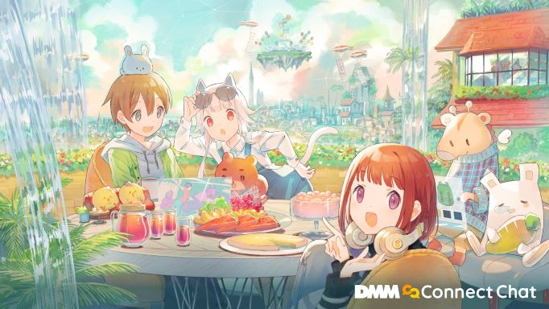

# DMM Connect Chat

- 概要：アバターを使って他人と交流したりイベントに参加するアプリ
- 期間：2020/8 - 現在
- 規模：unityエンジニア3-4名、サーバサイドエンジニア1名、3Dモデラー1名、UI/UXデザイナー1名
- 担当：クライアントサイド（Unity, C#, ShaderLab）
- デバイス：Windowsデスクトップ、PCVR

### プレスリリース・イベント実績

<blockquote>
<a href="https://prtimes.jp/main/html/rd/p/000003703.000002581.html">DMM VR lab開発のVRコミュニケーションアプリ「Connect Chat」無料でアーリーアクセス開始</a>
2021年1月26日
</blockquote>

<blockquote>
<a href="https://prtimes.jp/main/html/rd/p/000003912.000002581.html">DMMが提供するメタバース/VR SNSアプリ「DMM Connect Chat」が本格始動！ボーカロイド「GUMI」ライブの他、多数のVRコンテンツを配信予定</a>
2022年3月15日
</blockquote>

<blockquote>
<a href="https://sono-saki.jp/dmm-sonosaki-metaverse/">北九州市×DMM.com×みらいのおねんど「こどもバーチャル展示会」を開催！</a>
2022年3月16日
</blockquote>

<blockquote>
<a href="https://prtimes.jp/main/html/rd/p/000000167.000069194.html">大日本印刷　AKIBA観光協議会とともに「バーチャル秋葉原」をオープン</a>
2022年4月4日
</blockquote>

<blockquote>
<a href="https://prtimes.jp/main/html/rd/p/000000047.000005296.html">細田守監督最新作『竜とそばかすの姫』 Blu-ray & DVD 発売記念バーチャル秋葉原 『竜とそばかすの姫』 デジタル展示会を開催！素敵なプレゼントが当たるキャンペーンも</a>
2022年4月27日
</blockquote>

### 主な担当業務
- 

メタバースとしてアプリを成立させユーザー数を獲得するための各種機能の仕様策定、実装、評価

  #### 担当した機能実装
  - グラブ機能
  - 絵文字付きコメント機能
  - カメラ機能
  - アルバム機能
  - ツイッターシェア機能
  - 旧UIの実装
  - UI刷新に伴う新メニューの挙動の実装
  - アイテム機能
  - アバターの広義LOD機能
  - ブロック/キック機能
  - ライブイベント用機能
  - その他多数
  #### その他業務
  - バグ修正・リファクタ・ポリッシュ

- 定量分析を可能にするためのUnityAnalyticsを用いたKPI分析システムの構築、運用を実現、定着化
- ユーザー体験向上のために、負荷計測と最適化を行い、90fpsでの動作を達成
- 手戻り最小化のために、デザインチームと連携しカンプ作成を補助
- ユーザーコミュニティ形成のために、アプリ内イベントの運営補助や登壇を実施
- スクラムマスターとしてチーム運営に尽力
