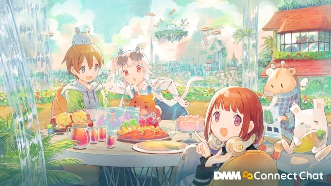

# DMM Connect Chat

- Summary: An application that uses avatars to interact with others in a 3DCG space and join events
- Period: 2020/8 - Present
- Size: 3-4 unity engineers, 1 server-side engineer, 1 3D modeler, 1 UI/UX designer
- Responsibilities: Client side (Unity, C#, ShaderLab)
- Devices: Windows desktop, PCVR

### Press releases

<blockquote>
<a href="https://prtimes.jp/main/html/rd/p/000003703.000002581.html">DMM VR lab開発のVRコミュニケーションアプリ「Connect Chat」無料でアーリーアクセス開始</a>
2021年1月26日
</blockquote>

<blockquote>
<a href="https://prtimes.jp/main/html/rd/p/000003912.000002581.html">DMMが提供するメタバース/VR SNSアプリ「DMM Connect Chat」が本格始動！ボーカロイド「GUMI」ライブの他、多数のVRコンテンツを配信予定</a>
2022年3月15日
</blockquote>

<blockquote>
<a href="https://sono-saki.jp/dmm-sonosaki-metaverse/">北九州市×DMM.com×みらいのおねんど「こどもバーチャル展示会」を開催！</a>
2022年3月16日
</blockquote>

<blockquote>
<a href="https://prtimes.jp/main/html/rd/p/000000167.000069194.html">大日本印刷　AKIBA観光協議会とともに「バーチャル秋葉原」をオープン</a>
2022年4月4日
</blockquote>

<blockquote>
<a href="https://prtimes.jp/main/html/rd/p/000000047.000005296.html">細田守監督最新作『竜とそばかすの姫』 Blu-ray & DVD 発売記念バーチャル秋葉原 『竜とそばかすの姫』 デジタル展示会を開催！素敵なプレゼントが当たるキャンペーンも</a>
2022年4月27日
</blockquote>

### Main Responsibilities
- Specification, implementation, and evaluation of various features to establish the application as a metaverse and gain users
  #### Implementation I was in charge of
  - Grab system
  - Comment system supporting emoji
  - Camera system
  - Album system
  - Twitter share system
  - Implementation of old UI
  - Implementation of new menu behavior with UI renewal
  - Item system
  - Avatar LOD system
  - Block/Kick system
  - Dedicated features for live events
  - And many more
  #### Other work
  - Bug fixes, refactoring, polish
- Build, operate, and establish KPI analysis system using UnityAnalytics to enable quantitative analysis
- Achieve 90 fps operation by profiling and optimizing the load to improve user experience
- Collaborate with the design team to minimize rework and assist in creating an application's comprehensive layout.
- Assist in organizing in-app events and speaking at events to build and grow a user community.
- Serve as scrum master for a team
